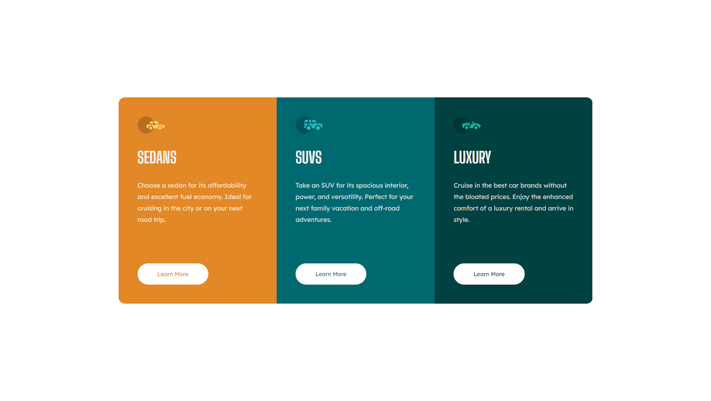

# Frontend Mentor - 3-column preview card component solution

This is a solution to the [3-column preview card component challenge on Frontend Mentor](https://www.frontendmentor.io/challenges/3column-preview-card-component-pH92eAR2-). Frontend Mentor challenges help you improve your coding skills by building realistic projects.

## Table of contents

- [Overview](#overview)
  - [The challenge](#the-challenge)
  - [Screenshot](#screenshot)
  - [Links](#links)
- [My process](#my-process)
  - [Built with](#built-with)
  - [What I learned](#what-i-learned)
- [Author](#author)

## Overview

### The challenge

Users should be able to:

- View the optimal layout depending on their device's screen size
- See hover states for interactive elements

### Screenshot



### Links

- Solution URL: [https://www.frontendmentor.io/solutions/solution-of-the-3column-preview-card-component-using-flexbox-WL-A_cnIQ](https://www.frontendmentor.io/solutions/solution-of-the-3column-preview-card-component-using-flexbox-WL-A_cnIQ)
- Live Site URL: [https://jakubszpil.github.io/frontend-mentor/3-column-preview-card-component-main/](https://jakubszpil.github.io/frontend-mentor/3-column-preview-card-component-main/)

## My process

### Built with

- Semantic HTML5 markup
- CSS custom properties
- Flexbox
- Mobile-first workflow
- [SCSS](https://sass-lang.com/) - SCSS

### What I learned

I learned how to implement responsive layout using a few lines of code

```scss
.container {
  width: clamp(250px, 100%, 1180px);
  display: flex;
  align-items: center;

  .grid {
    ...
    display: flex;
    justify-content: center;
    flex-wrap: wrap;
    ...
  }
}
.card {
  flex: 1 1 300px;
  ...
}
```

## Author

- Website - [https://jakubszpil.pl](https://jakubszpil.pl)
- Frontend Mentor - [@jakubszpil](https://www.frontendmentor.io/profile/jakubszpil)
